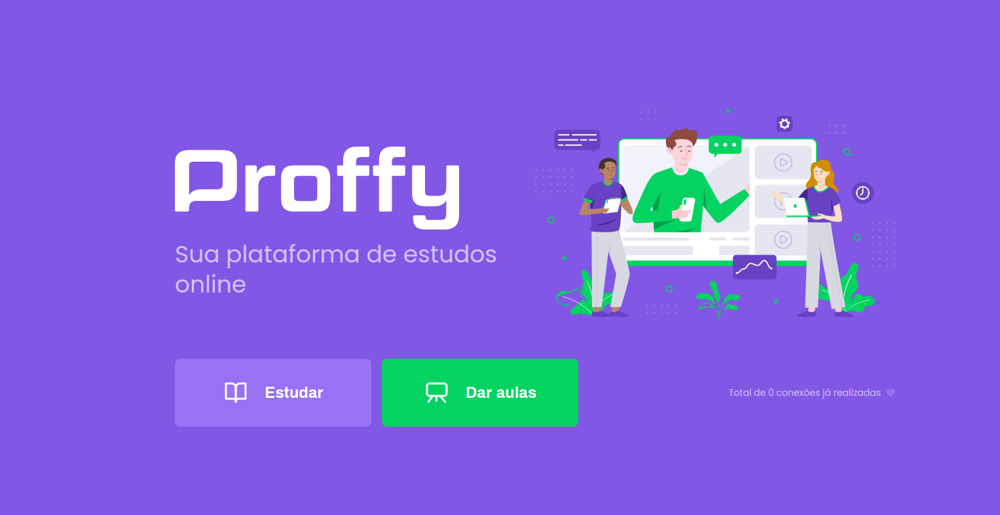

# NLW-02



## 🔖 Sobre

Plataforma de estudo para conexão entre professores e alunos desenvolvido durante a Next Level Week 2, da <a target="_blank" href="https://rocketseat.com.br">Rocketseat.

---

## 🗂 Baixar e executar o projeto

```bash

    # Clonar o repositório
    $ git clone https://github.com/filipecsoares/NLW-02

    # Entrar no diretório desejado
    $ cd web
    ou
    $ cd mobile
    ou
    $ cd server

    # Instalar as dependências
    $ npm install

    # Iniciar o projeto
    $ npm start
```

---

## 🛠️ Tecnologias utilizadas

- NodeJs
- Typescript
- ReactJs
- React Native
